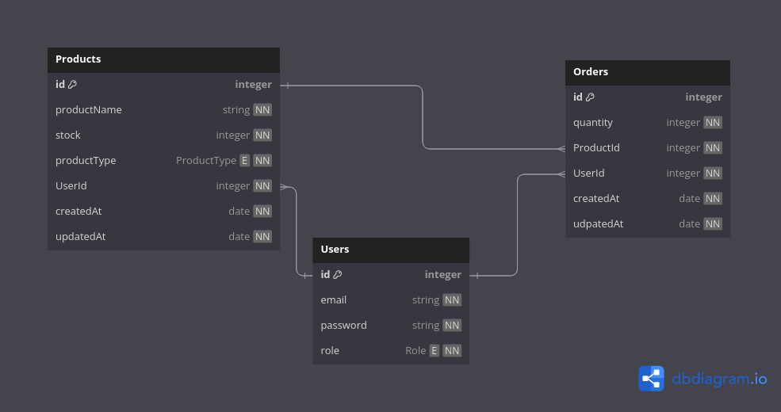

# List of Entities

## Products
```json
{
    "id": number,
    "productName": string,
    "stock": number,
    "productType": string,
    "UserId": string,
    "createdAt": string,
    "updatedAt": string,
}
```

## Orders
```json
{
    "id": number,
    "quantity": number,
    "ProductId": number,
    "UserId": number,
    "createdAt": string,
    "updatedAt": string
}
```

## Users
```json
{
    "id": number,
    "email": string,
    "password": string,
    "role": string,
}
```
## Schema
[schema_link](https://dbdiagram.io/d/qtasnim_test-65799bd456d8064ca0f2e54d)


<br>

# List of Available Endpoints